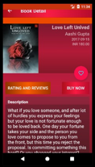

# Online Book Store App
This is an app which allows to the user to buy their favorite books from AMAZON and read online free books from Google Book Library in any category including business, fantasy, romance, fiction and non-fiction. It has integrated with both AMAZON AWS API and Google Book RESTful API.  

## Features 
* Google authentication login feature. 
* Specific product search option. 
* Search by category feature. 
* Book details feature. 
* Add favorite feature. 
* Reviews and rating feature for paid books and full view for free ebooks.
* Buy feature to open link in web view for paid ebooks. 
* Widget feature to show famous books from online firebase database. 
* Share feature.

## User Interface Mocks 
### Screen 1: Main Activity 
* Home screen 

* Navigation Drawer of Main Activity

### Screen 2: Detail Activity

  

#### Tablet View

###Screen 3: View Activity 
* Implemented google Embedded Viewer API for online book preview. 
* Linked with HTML and JavaScript files from Assets folder.

###Screen 4: Favorite Activity 

###Screen 5 App Widget 

#### Share Option

##### Handle Data Persistence? 
I have built a custom content provider with realm database. 

##### Open source libraries. 
* **Retrofit** - to fetch JSON data from web. 
* **Realm** - to store local data. 
* **Butterknife** - to inject views with components.

##### Google Play Services: _
* **Firebase** - For Firebase real-time database for getting famous books.
* **Firebase AdMob** - For Ads.
* **Variants** - Built both variant Free and Paid.

**_Enjoy_… :) **
*****
